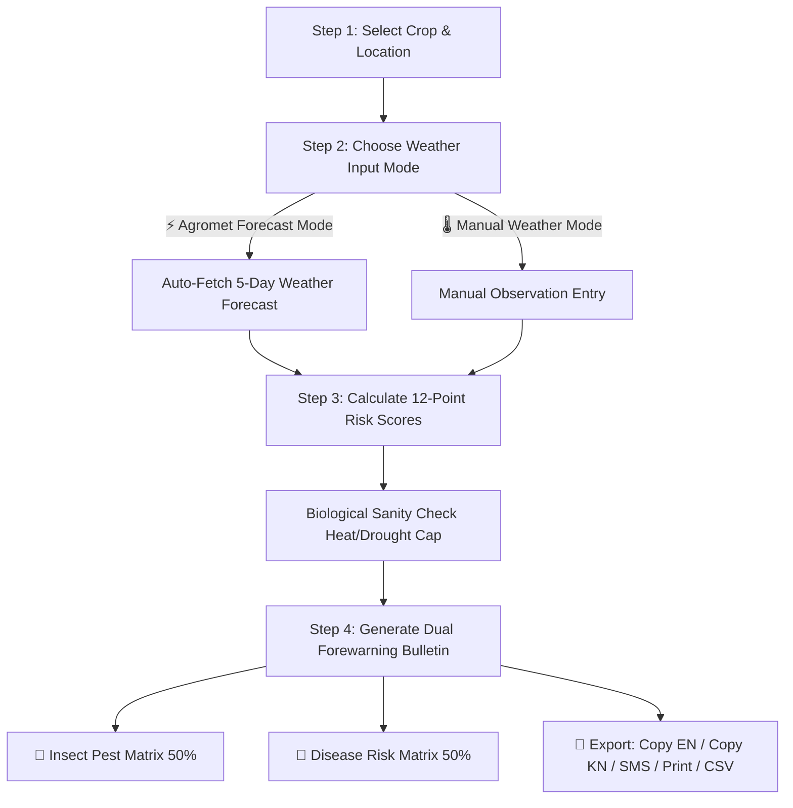

# 🏫 Keladi Shivappa Nayaka University of Agricultural and Horticultural Sciences, Shivamogga (KSNUAHS)
## 🌾 Pest & Disease Risk Assessment and Forewarning System
### (ಕೀಟ ಮತ್ತು ರೋಗ ಮುನ್ನೆಚ್ಚರಿಕಾ ಹಾಗೂ ಸಲಹಾ ವ್ಯವಸ್ಥೆ)

An advanced, single-file HTML5/JS web application designed to provide weather-based agro-advisories, insect pest risk evaluations, and fungal/bacterial disease forewarning bulletins for farmers across Karnataka.

---

## 📌 1. Overview & Key Capabilities

- **Official University Branding**: Keladi Shivappa Nayaka University of Agricultural and Horticultural Sciences, Shivamogga (KSNUAHS).
- **System Name**: Pest & Disease Risk Assessment and Forewarning System (*ಕೀಟ ಮತ್ತು ರೋಗ ಮುನ್ನೆಚ್ಚರಿಕಾ ಹಾಗೂ ಸಲಹಾ ವ್ಯವಸ್ಥೆ*).
- **31 Karnataka Districts & 193 Blocks/Taluks**: Fully embedded dataset covering all agricultural zones in Karnataka.
- **Automatic Weather Integration**: Pre-loaded with **970 daily weather forecast records** extracted directly from Karnataka Agromet Datasets.
- **Dual 50:50 Side-by-Side Risk Matrix**: Distinct, dedicated evaluation matrices for **🐛 Insect Pests** (Sunset Amber Theme) and **🍄 Fungal/Bacterial Diseases** (Amethyst Purple Theme).
- **Scientific 12-Point Risk Scoring Engine**: Evaluates Maximum Temperature ($T_{max}$), Minimum Temperature ($T_{min}$), Canopy Relative Humidity ($RH$), 5-Day Rainfall Accumulation, Dew Proxy, Wind Speed, Cloud Cover, and Crop Stage Susceptibility.
- **Biological Heat & Drought Sanity Check**: Automatically caps fungal/bacterial disease risk scores at $\le 5/12$ (LOW/MEDIUM) if $T_{max} > 36^\circ\text{C}$ or $RH < 55\%$.
- **Bilingual Advisories (English + ಕನ್ನಡ)**: Clear management guidelines and chemical recommendations with all numbers displayed in standard English numerals (`0, 1, 2, 3, 4, 5, 6, 7, 8, 9`).
- **100% Responsive Auto-Fit Layout**: Fluid, auto-fitting UI design across Mobile, Tablet, and Desktop PC viewports.
- **100% Offline Standalone Operation**: Zero external API dependencies; runs directly from local disk via `file:///`.

---

## 🔬 2. Scientific 12/12 Risk Model & Dewfall Calculation

### **A. How the 12/12 Threat Scoring System Works**
Each pest or disease is evaluated against 7 agrometeorological factors and crop stage susceptibility to produce a **cumulative threat score from 0 to 12**:

| Parameter | Points Awarded | Condition |
| :--- | :---: | :--- |
| **Max Temperature ($T_{max}$)** | **+2 pts** (or +1) | Within optimal daytime pathogen multiplication range |
| **Min Temperature ($T_{min}$)** | **+2 pts** (or +1) | Within nocturnal larval/fungal spore germination range |
| **Relative Humidity ($RH$)** | **+2 pts** (or +1) | Above canopy moisture threshold ($\ge 80\%$) |
| **Rainfall Accumulation** | **+2 pts** (or +1) | Conducive 5-day cumulative rainfall spell |
| **Dewfall Proxy Index** | **+2 pts** (or +1) | Nocturnal leaf wetness duration (HIGH / VERY HIGH) |
| **Wind Speed ($\le 10 \text{ km/h}$)** | **+1 pt** | Calm boundary layer favoring spore/insect settlement |
| **Cloud Cover ($\ge 5 \text{ octa}$)** | **+1 pt** | Overcast conditions reducing solar UV spore mortality |
| **Crop Stage Susceptibility** | **+1 pt** | Current growth phase matches vulnerable stage |
| **Total Maximum Score** | **12 / 12** | **VERY HIGH RISK Level** |

#### ⚠️ **Biological Heat & Drought Sanity Check**
Fungal and bacterial foliar pathogens cannot proliferate under extreme heat or desiccation. The engine enforces a biological rule:
> **If $T_{max} > 36^\circ\text{C}$ or $RH < 55\%$, fungal/bacterial disease scores are automatically capped at $\le 5/12$ (LOW / MEDIUM risk).**

---

### **B. How Dewfall Proxy Index is Calculated**
Nocturnal dewfall and leaf wetness duration ($LWD$) are critical for fungal spore germination (e.g., Rice Blast, Groundnut Tikka, Arecanut Koleroga). The Dewfall Proxy Index categorizes leaf wetness into 5 levels:

1. **NIL**: $RH < 60\%$ and Rainfall $< 0.5\text{ mm}$ (Dry canopy, zero dew).
2. **LOW**: $RH = 60\% - 74\%$ (Minimal trace moisture).
3. **MID**: $RH = 75\% - 87\%$ or Rainfall $\ge 0.5\text{ mm}$ (Moderate dew/fog).
4. **HIGH**: $RH \ge 88\%$ or ($RH \ge 80\%$ with Rainfall $\ge 2\text{ mm}$) (Heavy dew, prolonged leaf wetness).
5. **VERY HIGH**: $RH \ge 94\%$ or ($RH \ge 88\%$ with Rainfall $\ge 5\text{ mm}$) (Saturated canopy, continuous free water).

#### 🌫️ **Nocturnal Condensation Boosters**:
The Dewfall Proxy Index automatically increases by **+1 level** under any of the following nocturnal microclimate conditions:
- $T_{min} \le 24^\circ\text{C}$ and $RH \ge 80\%$ *(Cool night dew point condensation)*.
- Wind Speed $\le 6 \text{ km/h}$ and $RH \ge 80\%$ *(Calm air preventing dew evaporation)*.
- Cloud Cover $\ge 6 \text{ octa}$ and $RH \ge 80\%$ *(Overcast night trapping boundary moisture)*.

---

## ⚙️ 3. How the Engine Works (Step-by-Step Workflow)

---

## 🎨 4. Section Color System

| Section | Color Theme | Visual Elements |
| :--- | :--- | :--- |
| **University Header** | **Warm Cream & Gold** | KSNUAHS Logo, Gold Border `#f59e0b`, Cream Gradient |
| **Section 1: Parameters** | **Royal Sapphire Blue** | Top Accent `#2563eb`, Soft Tint `#f0f7ff` |
| **Section 2: Weather Dataset** | **Emerald Forest Green** | Top Accent `#059669`, Soft Tint `#f0fdf4` |
| **Section 3: Action Bar** | **Slate Navy & Blue** | Dynamic Highlighting Primary Button |
| **Model & Dew Guide** | **Slate Grey Tab** | Collapsible Guide Card `#475569` |
| **Section 4: Insect Pests** | **Sunset Amber** | Border `#d97706`, Warm Tint `#fffbeb` |
| **Section 4: Diseases** | **Amethyst Purple** | Border `#7c3aed`, Soft Purple Tint `#faf5ff` |

---

## 🌾 5. Supported Crops & Target Pests/Diseases

### 1. 🌾 **Rice (*ಭತ್ತ*)**
- **Diseases**: Blast (*ಬೆಂಕಿ ರೋಗ*), Sheath Blight (*ಸೊಂಪಿನ ಮಚ್ಚೆ ರೋಗ*), Bacterial Leaf Blight (*ಬ್ಯಾಕ್ಟೀರಿಯಾ ಎಲೆ ಕರಕಲು ರೋಗ*), False Smut (*ಸುಳ್ಳು ಮಸಗಿ ರೋಗ*), Brown Spot (*ಕಂದು ಮಚ್ಚೆ ರೋಗ*).
- **Insect Pests**: Yellow Stem Borer (*ಹಳದಿ ಕಾಂಡ ಕೊರೆಯುವ ಹುಳು*), Leaf Folder (*ಎಲೆ ಚುಟ್ಟುವ ಹುಳು*), Brown Planthopper (*ಕಂದು ನೆಗೆತ ಗಿಡಪೇಡ - BPH*).

### 2. 🌽 **Maize (*ಮೆಕ್ಕೆಜೋಳ*)**
- **Diseases**: Turcicum Leaf Blight (*ಟರ್ಸಿಕಮ್ ಎಲೆ ಕರಕಲು ರೋಗ*), Maydis Leaf Blight (*ಮೇಡಿಸ್ ಎಲೆ ಚುಕ್ಕೆ ರೋಗ*), Downy Mildew (*ಬೂದಿ ರೋಗ*), Stalk Rot (*ಕಾಂಡ ಕೊಳೆ ರೋಗ*).
- **Insect Pests**: Fall Armyworm (*ಸೈನಿಕ ಹುಳು - FAW*).

### 3. 🥜 **Groundnut (*ಶೇಂಗಾ*)**
- **Diseases**: Late Leaf Spot / Tikka (*ಟಿಕ್ಕಾ / ತಡ ಎಲೆ ಚುಕ್ಕೆ ರೋಗ*), Early Leaf Spot (*ಮುಂಗಡ ಎಲೆ ಚುಕ್ಕೆ ರೋಗ*), Rust (*ತುಕ್ಕು ರೋಗ*), Collar Rot (*ಬುಡ ಕೊಳೆ ರೋಗ*), Stem Rot (*ಕಾಂಡ ಕೊಳೆ ರೋಗ*).
- **Insect Pests**: Spodoptera litura (*ತಂಬಾಕು ಕತ್ತರಿಸುವ ಹುಳು*).

### 4. 🌴 **Arecanut (*ಅಡಿಕೆ*)**
- **Diseases**: Fruit Rot / Koleroga (*ಕೊಳೆ ರೋಗ / ಕಾಯಿ ಕೊಳೆ*), Bud Rot (*ಸುಳಿ ಕೊಳೆ ರೋಗ*), Inflorescence Dieback (*ಹಿಂಗಾರ ಒಣಗು ರೋಗ*), Foot Rot / Anabe Roga (*ಅನಬೆ ರೋಗ*).
- **Insect Pests**: Spindle Bug (*ಸುಳಿ ತಿಗಣೆ*).

---

## 🚀 6. How to Run

1. Open the file **`Pest_and_Disease_Prediction_Model.html`** directly in any modern web browser.
2. Select your **Crop**, **District**, **Block/Taluk**, and **Crop Stage**.
3. Click **`⚡ CLICK TO ASSESS RISK`** to view the **Pest and Disease Prediction Bulletin**!

---

*Developed for Keladi Shivappa Nayaka University of Agricultural and Horticultural Sciences, Shivamogga (KSNUAHS).*
